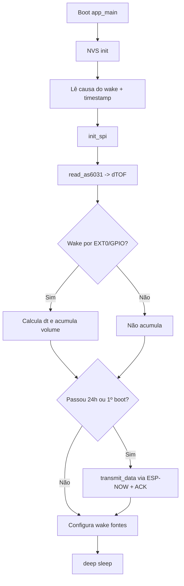
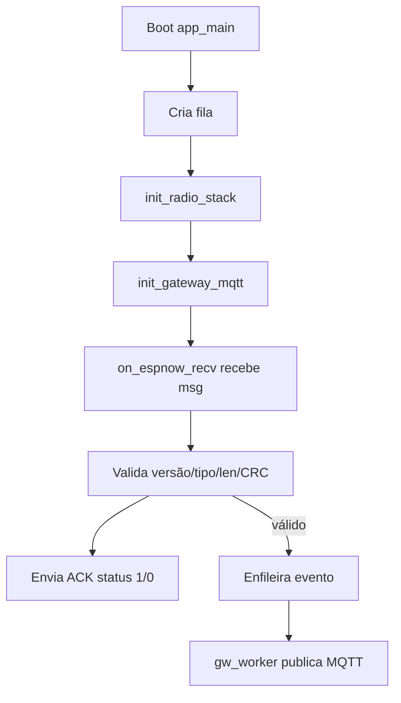

# Documentação do Firmware (flow-ultra)

Este documento descreve o que está implementado no firmware atual, com foco no arquivo [main/main.c](main/main.c).

## Modos de medição (acúmulo no ESP vs totalizador interno)

O firmware agora possui dois estilos de medição no modo Node (selecionados por flag de compilação):

- **Totalizador interno (AS6031 Flow Meter Mode)**: o AS6031 roda autonomamente totalizando volume internamente; o ESP acorda **somente 1x/dia por timer**, lê o volume total e transmite.
- **Legado (acúmulo no ESP)**: o ESP acorda pela interrupção do AS6031, calcula o incremento e acumula em RTC RAM.

A seleção é controlada por `AS6031_INTERNAL_TOTALIZER` em [main/main.c](main/main.c#L36).

## Visão geral

O firmware implementa dois papéis de execução (selecionados em tempo de compilação):

- **Node (hidrômetro)**: mede o fluxo via AS6031, acumula volume e envia telemetria **1x ao dia** via ESP-NOW para um gateway.
- **Gateway (central local)**: recebe telemetria via ESP-NOW, responde ACK para o node e publica a telemetria via MQTT.

A seleção do papel é controlada pela constante `DEVICE_ROLE_NODE` em [main/main.c](main/main.c#L36). No estado atual do código, ela está em **1** (modo Node).

## Componentes e bibliotecas usadas

- **ESP-IDF / FreeRTOS**: tarefas, delays e infraestrutura do sistema.
- **SPI Master (driver/spi_master)**: leitura do AS6031.
- **ESP-NOW + Wi-Fi (STA)**: transporte leve de telemetria Node → Gateway.
- **MQTT Client (esp_mqtt_client)**: somente no modo Gateway.
- **NVS (nvs_flash)**: inicialização de armazenamento (uso atual: init/erase quando necessário).
- **Deep Sleep (esp_sleep)**: economia de energia.

## Persistência durante Deep Sleep (RTC RAM)

O firmware mantém variáveis críticas em RTC RAM (preservadas durante deep sleep) via `RTC_DATA_ATTR` em [main/main.c](main/main.c#L48-L53):

- `total_volume_liters`: volume total acumulado (litros)
- `last_time_stamp`: timestamp do último ciclo (µs)
- `last_transmission`: timestamp do último envio (µs)
- `tx_sequence`: contador de sequência do protocolo
- `gateway_mac`: MAC do gateway (destino ESP-NOW)

Isso permite que o node acorde, faça um cálculo incremental e volte a dormir sem perder estado.

## SPI e AS6031 (leitura e conversão)

Além da leitura “bulk” usada no modo legado, foi adicionado um driver de acesso remoto (RAA) baseado nas opcodes do datasheet (seção 10.1.3 — `RC_RAA_RD/WR`).

- Header: [main/as6031_remote.h](main/as6031_remote.h)
- Implementação: [main/as6031_remote.c](main/as6031_remote.c)

### Hardware SPI

Pinos definidos em [main/main.c](main/main.c#L21-L26):

- `PIN_MOSI=7`, `PIN_MISO=6`, `PIN_SCK=5`, `PIN_CS=10`
- `PIN_INT_AS6031=11` (interrupção/trigger para wakeup)

### Inicialização do SPI

A função `init_spi()` em [main/main.c](main/main.c#L275-L286) configura:

- Host: `SPI2_HOST`
- Clock: **1.5 MHz**
- Modo: **SPI mode 1**
- CS: controlado pelo driver
- DMA: `SPI_DMA_CH_AUTO`

### Leitura do AS6031

A função `read_as6031()` em [main/main.c](main/main.c#L288-L304) executa uma transação SPI full-duplex:

- Envia 114 bytes (`tx_buf`), começando com `{0x7A, 0x80}` (comando indicado no comentário como leitura de `SHR_TOF_VAL`).
- Recebe 114 bytes em `rx_buf`.
- Extrai os campos:
  - `sum_up` a partir de `rx_buf[2..5]` em [main/main.c](main/main.c#L297)
  - `sum_down` a partir de `rx_buf[18..21]` em [main/main.c](main/main.c#L298)
- Converte para ns com um LSB fixo e um divisor em [main/main.c](main/main.c#L300-L303):
  - `lsb_ns = 125/65536`
  - `up_ns = (sum_up*lsb_ns)/10`
  - `down_ns = (sum_down*lsb_ns)/10`
  - `dTOF = up_ns - down_ns`

Observação: o firmware atual não mostra (ainda) uma etapa explícita de escrita de registradores/configuração do AS6031 (init do chip), nem um comando explícito de “start measurement”; ele assume que a leitura retorna valores coerentes.

No modo de **totalizador interno**, o ESP passa a ler diretamente o volume acumulado de RAM do AS6031 via RAA (`as6031_read_flow_volume_liters`). Para isso, é necessário configurar os endereços de `RAM_R_FLOW_VOLUME_INT` e `RAM_R_FLOW_VOLUME_FRACTION` (o datasheet público cita os nomes, mas não lista os endereços numéricos).

### Descoberta dos endereços (modo *discovery*)

Quando `AS6031_ADDR_RAM_FLOW_VOLUME_INT/FRACTION` estão indefinidos (`0xFFFF`), o firmware pode entrar em um modo de varredura (controlado por `AS6031_DISCOVERY_MODE` em [main/main.c](main/main.c)) para ajudar a descobrir os offsets corretos no seu hardware.

O que ele faz:

- Coleta **N snapshots** da RAM da RAA (`0x000..0x0AF`) com um intervalo configurável.
- Rankeia e imprime os **Top K** candidatos (endereços 32-bit e pares 32.32) por monotonicidade e delta.
- Opcionalmente também varre NVRAM (`0x100..0x1FF`) se habilitado.

Parâmetros via `menuconfig` (menu **AS6031 / Flow Meter**):

- `Discovery: numero de snapshots (N)`
- `Discovery: intervalo entre snapshots (ms)`
- `Discovery: top K candidatos por faixa`
- `Discovery: repeticoes (0 = infinito)`
- `Discovery: incluir NVRAM`

Como usar na prática:

- Faça o node inicializar e **gere fluxo de água durante a espera** entre as duas leituras.
- Observe no log quais endereços (ou pares) incrementam monotonicamente conforme o volume passa.
- Defina os endereços encontrados via `menuconfig` (menu **AS6031 / Flow Meter**) ou diretamente em [main/as6031_remote.h](main/as6031_remote.h) (macros `AS6031_ADDR_RAM_FLOW_VOLUME_INT/FRACTION`).

Depois disso, o modo “acorda 1x/dia, lê total, transmite” funciona sem a varredura.

### Validação do totalizador (modo *validação*)

Para validar rapidamente se os endereços escolhidos fazem sentido (sem depender do envio 1x/dia), existe um modo de validação via `menuconfig` (menu **AS6031 / Flow Meter**):

- `Validacao: ler total e calcular L/min`
- `Validacao: intervalo entre leituras (ms)`

Quando habilitado (e com os endereços já definidos), o node entra em um loop que:

- Lê `as6031_read_flow_volume_liters()` periodicamente
- Imprime o total acumulado (L)
- Calcula e imprime a taxa aproximada em **L/min** a partir do delta do total e do tempo entre leituras

### Modo manutenção

Para diagnóstico em bancada/instalação, existe um modo de manutenção via `menuconfig` (menu **AS6031 / Flow Meter**):

- `Manutencao: diagnostico continuo (sem sleep/sem TX)`
- `Manutencao: intervalo (ms)`

Quando habilitado, o Node não entra em deep sleep e não transmite; ele apenas imprime continuamente:

- `FWU_RNG/FWU_REV/FWA_REV`
- total acumulado (L)
- delta e taxa aproximada (L/min)

## Cálculo de volume

A função `calculate_instant_volume()` em [main/main.c](main/main.c#L306-L312) calcula um volume incremental baseado em:

- Área da seção do tubo: $A = \pi (D/2)^2$
- Velocidade do fluido (modelo simplificado):

$$v = \frac{\Delta t \cdot c^2}{2L}$$

onde:
- $\Delta t$ = `dTOF_ns` convertido para segundos
- $c$ = `CO` (velocidade do som)
- $L$ = distância entre transdutores

Depois:
- vazão: `flow_ls = v * A * 1000` (m³/s → L/s)
- volume no intervalo: `flow_ls * dt`.

Constantes físicas em [main/main.c](main/main.c#L28-L32):
- `CO=1482 m/s`, `L=0.07 m`, `D=0.027 m`.

## Protocolo de aplicação sobre ESP-NOW

### Estruturas

- Payload Node → Gateway (atual): `sensor_msg_t` em [main/main.c](main/main.c)
- Payload Node → Gateway (legado, compatibilidade): `sensor_msg_v1_t` em [main/main.c](main/main.c)
- ACK Gateway → Node: `gateway_ack_t` em [main/main.c](main/main.c)

Campos principais:

- `version` e `msg_type`: versionamento e roteamento do tipo de mensagem
- `payload_len`: usado como sanity-check
- `device_id`: identificador do node (no exemplo, fixo em `0xABCD`)
- `sequence`: contador incremental por envio
- `crc16`: integridade dos dados

Campo adicional de diagnóstico:

- `status_code`: código de status do node para diagnóstico remoto (endereços não configurados, falha de leitura SPI, total regressivo, delta anômalo, erro de NVS, etc.). O Gateway repassa esse campo no JSON publicado via MQTT.

Campos adicionais de telemetria de boot/wake:

- `reset_reason`: valor numérico de `esp_reset_reason()` (motivo do último reset/boot).
- `wakeup_cause`: valor numérico de `esp_sleep_get_wakeup_cause()` (fonte do wake do deep sleep).

Esses dois campos são úteis para diferenciar, por exemplo, wake por timer vs GPIO e detectar power-cycle/soft-reset em campo.

### CRC16

`crc16_ccitt()` em [main/main.c](main/main.c) calcula CRC-CCITT (polinômio 0x1021).

Regras:

- Node: calcula o CRC sobre `sizeof(sensor_msg_t)` com `crc16=0`.
- Gateway: valida o CRC sobre o tamanho real do frame recebido (v1 ou v2), zerando os **2 últimos bytes** (campo CRC).

### Node: envio com confirmação

O envio é feito em `transmit_data()` em [main/main.c](main/main.c#L383-L459):

- Inicializa rádio/ESP-NOW via `init_radio_stack()`.
- Adiciona peer do gateway com o MAC configurado em `gateway_mac`.
- Monta `sensor_msg_t`, incrementa `tx_sequence` e calcula CRC.
- Faz até `MAX_SEND_RETRIES` tentativas.
- Confirma em dois níveis:
  1. **Status MAC** via callback `on_espnow_send()` em [main/main.c](main/main.c#L127-L133)
  2. **ACK de aplicação** via callback de recebimento `on_espnow_recv()` (modo Node) em [main/main.c](main/main.c#L135-L161)

A validação do ACK inclui:
- tipo/versão
- CRC
- sequência igual ao último envio
- `status == 1`

### Gateway: valida, responde ACK e encaminha

No modo Gateway, o `on_espnow_recv()` em [main/main.c](main/main.c):

- Aceita dois tamanhos de payload (legado v1 e atual v2).
- Valida tipo/versão e `payload_len` (sanity-check: `payload_len == len - 6`).
- Recalcula CRC.
- Monta e envia `gateway_ack_t` ao MAC origem.
- Se válido, empacota o evento e coloca em uma fila para publicação MQTT.

## Rádio (Wi-Fi + ESP-NOW)

A stack de rádio é iniciada em `init_radio_stack()` em [main/main.c](main/main.c#L315-L369):

- `esp_netif_init()`
- `esp_event_loop_create_default()`
- `esp_wifi_init()`
- Wi-Fi modo `WIFI_MODE_STA`
- `esp_wifi_start()`
- `esp_now_init()`
- Registro de callbacks (send_cb só no Node; recv_cb em ambos)

Desinicialização para economizar energia em `deinit_radio_stack()` em [main/main.c](main/main.c#L371-L381).

## Deep Sleep: como foi configurado

No modo Node, após medir/possivelmente enviar, o firmware entra em deep sleep.

- **Totalizador interno**: wakeup **somente por timer (1 dia)**.
- **Legado**: wakeup por interrupção do AS6031 + timer de segurança.

Fontes de wakeup configuradas:

1. **Wake por interrupção (pino do AS6031)**
- Se houver suporte EXT0 e o pino for RTC válido, habilita:
  - `esp_sleep_enable_ext0_wakeup(PIN_INT_AS6031, 0)` em [main/main.c](main/main.c#L520)
- Caso contrário, habilita wakeup por GPIO:
  - `esp_deep_sleep_enable_gpio_wakeup(1ULL << PIN_INT_AS6031, ESP_GPIO_WAKEUP_GPIO_LOW)` em [main/main.c](main/main.c#L525)

2. **Wake por timer (segurança)**
- `esp_sleep_enable_timer_wakeup(3600s)` em [main/main.c](main/main.c#L527)

Entrada em deep sleep:
- `esp_deep_sleep_start()` em [main/main.c](main/main.c#L528)

Uso da causa de wake:
- `esp_sleep_get_wakeup_cause()` em [main/main.c](main/main.c#L492)
- O node só acumula volume quando acorda por `EXT0` ou `GPIO` em [main/main.c](main/main.c#L499-L505).

## Envio diário: como está implementado

No modo Node com **totalizador interno** (AS6031), o ESP entra em deep sleep com wakeup por **TIMER de 1 dia** e, ao acordar, **sempre transmite** (e também transmite no primeiro boot).

Observação: em deep sleep o chip reinicia e `esp_timer_get_time()` volta a 0, então o “agendamento por diferença de timestamps” não é confiável nesse modo.

Importante: **o node não usa MQTT**. MQTT está implementado apenas no modo Gateway.

## MQTT (somente Gateway)

No modo Gateway, o firmware:

- Inicializa cliente MQTT em [main/main.c](main/main.c#L462-L480)
- Publica telemetria em JSON no tópico:
  - `prefix/bairro/setor/deviceId/telemetry` em [main/main.c](main/main.c#L165-L172)
- A publicação em si ocorre em [main/main.c](main/main.c#L174-L200)
- A fila/worker desacoplam recepção de rádio da publicação MQTT em [main/main.c](main/main.c#L202-L211).

## Fluxos resumidos (diagramas)

### Node (modo atual)

### Gateway (quando DEVICE_ROLE_NODE=0)

## Limitações/assunções atuais

- `device_id` e `battery_mv` estão fixos no exemplo em [main/main.c](main/main.c#L406-L410).
- `gateway_mac` precisa ser ajustado para o MAC real do gateway em [main/main.c](main/main.c#L53).
- ESP-NOW está sem criptografia (`encrypt=false`).
- O acesso ao AS6031 está no modo “leitura direta” (sem sequência explícita de init/config do chip no código apresentado).

## Como alternar para modo Gateway

- Alterar `DEVICE_ROLE_NODE` para 0 em [main/main.c](main/main.c#L36) e recompilar.

---

Se quiser, o próximo passo natural é separar este código em módulos (`as6031.*`, `radio_espnow.*`, `protocol.*`) para reduzir o tamanho do `main.c` e facilitar testes/validação de cada componente.
